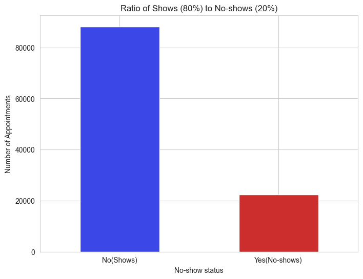
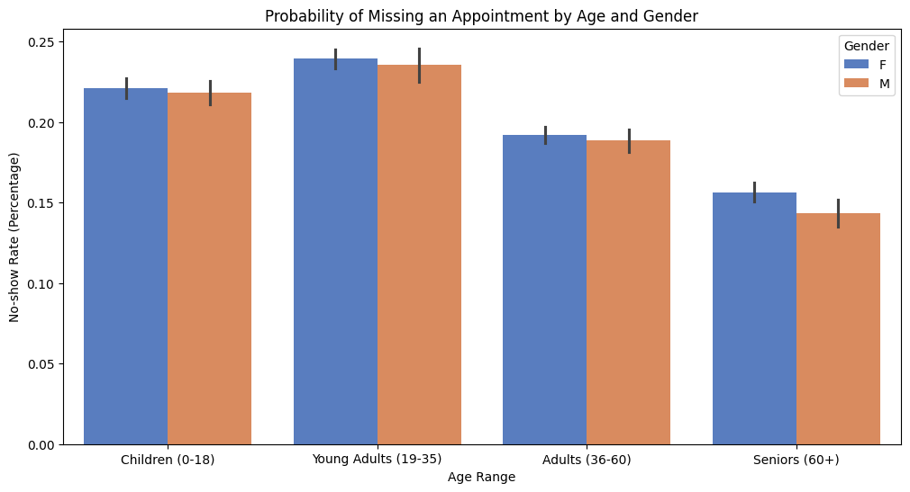
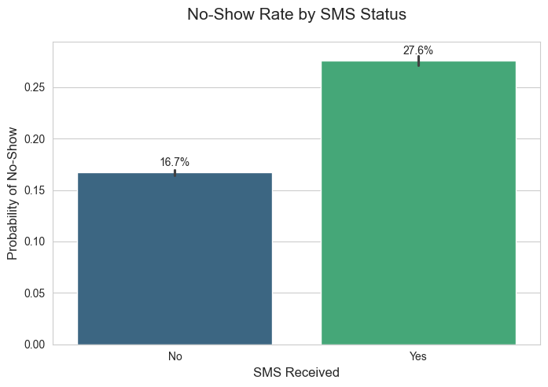
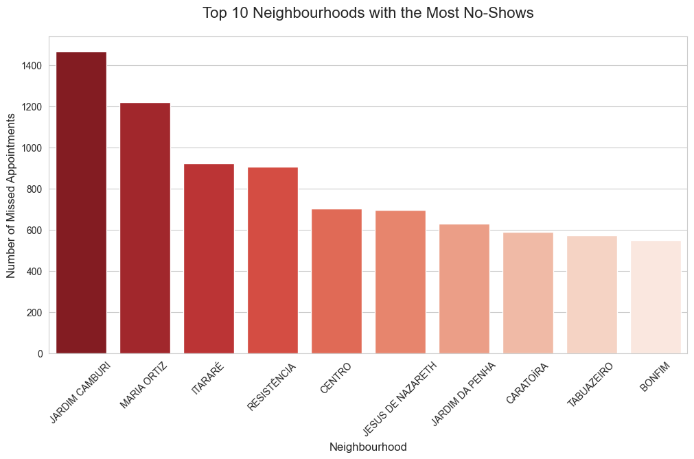

# 🏥 Medical Appointment No-Shows: A Predictive Analysis

### *From Exploratory Data Analysis to Cost-Sensitive Machine Learning*

---

## 📌 Executive Summary

This project investigates the factors contributing to patient absenteeism in the Brazilian healthcare system. Utilizing a dataset of over **110,000 medical records**, the analysis identifies key behavioral drivers of appointment no-shows and develops a predictive model designed to minimize the financial and operational impact of empty appointment slots.

**Data Source:** [Kaggle – Medical Appointment No Shows](https://www.kaggle.com/datasets/joniarroba/noshowappointments)

---

## 📊 Phase 1: Exploratory Data Analysis (EDA)

The exploratory analysis uncovered four core patterns that explain patient attendance behavior.

---

### 1️⃣ The 20% Absenteeism Baseline

The dataset reveals a consistent **20.2% no-show rate**, meaning approximately **1 in every 5 medical appointments** is missed. This represents a significant operational inefficiency and a strong opportunity for optimization.

---

### 2️⃣ Demographic Vulnerabilities (Age vs Gender)

Age shows a strong relationship with attendance behavior. **Young adults (ages 19–35)** have the highest likelihood of missing appointments. In contrast, **gender has no meaningful impact**, as male and female patients exhibit nearly identical no-show probabilities.

---

### 3️⃣ The SMS & Lead-Time Paradox

A counterintuitive pattern emerged: patients who received SMS reminders were **more likely** to miss their appointments. Further analysis revealed that SMS reminders are primarily sent for appointments with **long scheduling lead times**, suggesting that waiting time friction outweighs the benefit of a simple reminder.

---

### 4️⃣ Geographic Concentration of No-Shows

The neighborhood **Jardim Camburi** records the highest *absolute* number of no-shows, while several smaller neighborhoods exhibit higher *percentage-based* absenteeism. This distinction enables either high-volume or high-precision intervention strategies.

---

## ⚙️ Phase 2: Feature Engineering & Preprocessing

To prepare the data for machine learning, several transformations were applied:

- **Temporal Engineering:** Converted `ScheduledDay` and `AppointmentDay` into a numerical `waiting_days` feature, capturing appointment lead time.
- **Categorical Encoding:** Applied **One-Hot Encoding** to the high-cardinality `Neighbourhood` variable (80+ unique values).
- **Feature Scaling:** Standardized numerical features such as `Age` and `waiting_days` using `StandardScaler` to ensure balanced model learning.

---

## 🤖 Phase 3: Machine Learning & Handling Class Imbalance

The primary modeling challenge was the **imbalanced target distribution** (≈80% Show vs 20% No-Show).

### Baseline Model: The Accuracy Trap

An initial Logistic Regression model achieved **80% accuracy** but only **1% recall** for no-shows. The model learned to predict “Show” for nearly all patients, rendering it ineffective for identifying absenteeism.

### Balanced Logistic Regression (Final Model)

A cost-sensitive approach using `class_weight='balanced'` was implemented to prioritize recall for no-shows.

| Metric | Baseline Model | Balanced Model |
|------|---------------|----------------|
| **Accuracy** | 80% | 57% |
| **No-Show Recall** | 1% | **86%** |
| **No-Show Precision** | 42% | 30% |

**Key Outcome:**  
While overall accuracy decreased, the model successfully identified **86% of missed appointments**, transforming it from a “safe” model into a **decision-useful system**.

---

## 💡 Strategic Recommendations

Based on the analysis, the following actions are recommended:

1. **Targeted Outreach:** Prioritize manual reminders for patients aged **19–35** and appointments with **lead times over 10 days**.
2. **Neighborhood Intervention:** Pilot same-day confirmation strategies in **Jardim Camburi**, the highest no-show volume area.
3. **Controlled Overbooking:** Use high no-show recall to safely overbook **10–15%** of high-risk slots to improve provider utilization.

---

## 🛠️ Technical Stack

- **Pandas / NumPy** – Data cleaning and transformation  
- **Matplotlib / Seaborn** – Statistical visualization  
- **Scikit-Learn** – Feature pipelines, Logistic Regression, evaluation metrics  

---

## 📬 Contact

**LinkedIn:** [Fareed Ologundudu](https://www.linkedin.com/in/fareed-ologundudu-129506249/)  
**GitHub:** [@Fareed04](https://github.com/Fareed04)
